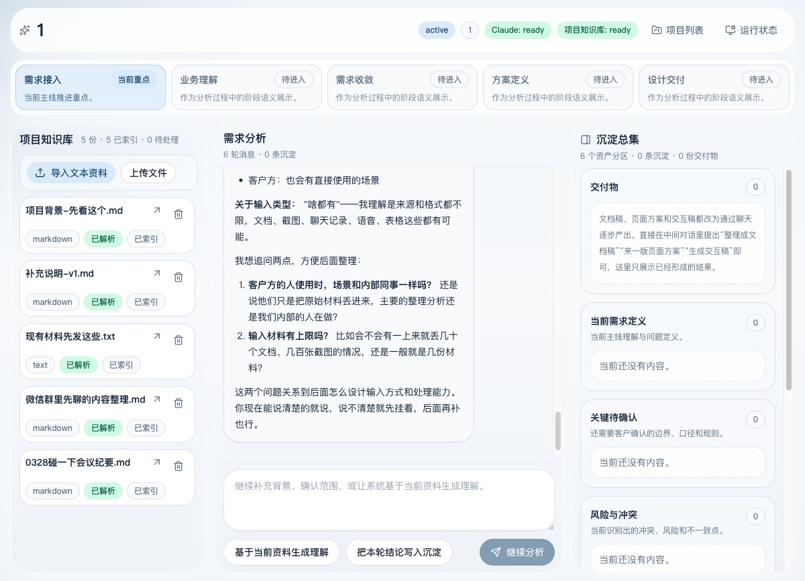
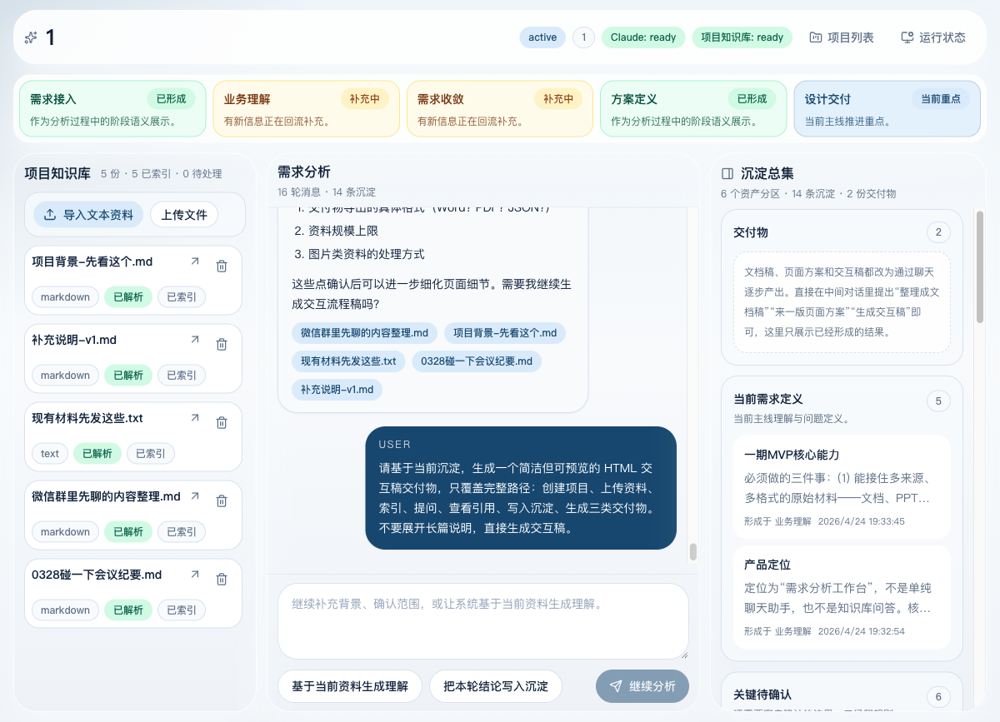

# 需求分析工作台完整 E2E 测试报告

测试对象：项目 `project-b069e87f56`（项目名：`1`）  
测试时间：2026-04-24  
测试目标：把“需求分析工作台”自身作为客户需求，通过已上传的基础知识库，与智能体完成需求分析、沉淀和交付物生成，并记录聊天过程、界面变化、交付物和问题。

## 1. 环境与初始状态

- 前端：`http://127.0.0.1:4173/`
- 后端：`http://127.0.0.1:8001/`
- Claude readiness：`ready`
- 项目知识库 readiness：`ready`
- 已索引资料：5 份
  - `项目背景-先看这个.md`
  - `补充说明-v1.md`
  - `现有材料先发这些.txt`
  - `微信群里先聊的内容整理.md`
  - `0328碰一下会议纪要.md`

初始截图：

## 2. 执行过程概览

- 01-grounded-overview：完成，耗时 42.94s；事件：assistant_status:6, message_chunk:300, citations:1, current_understanding_patch:1, pending_items_patch:1, done:1
- 02-mvp-scope：完成，耗时 52.17s；事件：assistant_status:9, message_chunk:331, citations:1, current_understanding_patch:1, pending_items_patch:1, conflict_items_patch:1, mvp_items_patch:1, done:1
- 03-document-artifact：完成，耗时 51.16s；事件：assistant_status:4, message_chunk:116, version_patch:1, artifact_patch:1, done:1
- 04-page-solution-artifact：完成，耗时 188.44s；事件：assistant_status:7, message_chunk:286, citations:1, version_patch:1, artifact_patch:1, done:1
- 05-interaction-artifact：失败/中断，耗时 16.88s；事件：assistant_status:1, message_chunk:16
- 06-interaction-artifact-retry：失败/中断；事件：assistant_status:1, message_chunk:4, error:1, done:1

原始 SSE 记录保存在：`raw/chat-*.sse`。

## 3. 聊天与智能体行为记录

### 3.1 资料检索和引用

- chat-01-01-grounded-overview.sse：返回 citation，来源：0328碰一下会议纪要.md, 微信群里先聊的内容整理.md, 现有材料先发这些.txt, 补充说明-v1.md, 项目背景-先看这个.md
- chat-02-02-mvp-scope.sse：返回 citation，来源：0328碰一下会议纪要.md, 微信群里先聊的内容整理.md, 现有材料先发这些.txt, 补充说明-v1.md, 项目背景-先看这个.md
- chat-04-04-page-solution-artifact.sse：返回 citation，来源：0328碰一下会议纪要.md, 微信群里先聊的内容整理.md, 现有材料先发这些.txt, 补充说明-v1.md, 项目背景-先看这个.md

### 3.2 关键结论沉淀

最终状态区数量：

- 当前需求定义：5
- 关键待确认：6
- 风险与冲突：1
- MVP 结论：2
- 版本快照：2
- 交付物：2

主要形成的业务结论包括：

- 产品定位是“需求分析工作台”，不是普通聊天助手，也不是知识库问答。
- 一期核心是接住多来源、多格式、散乱的原始需求材料，并往下梳理。
- 目标用户包括内部售前/咨询/产品，也包括客户方直接使用。
- 一期 MVP 的关键能力是资料接入、梳理、沉淀、基础交付物生成。
- 关键待确认点包括输出交付物形态、输入材料规模上限、客户方实际使用方式、图片资料处理方式。

## 4. 交付物结果

- `page_solution`：需求分析工作台一期页面方案，状态 `generated`，格式 `html`。摘要：围绕项目列表、三栏工作台（资料索引、聊天区、沉淀区）、交付物预览，给出页面结构、关键组件、状态流转和异常态的完整方案
- `document`：需求分析工作台一期需求规格说明，状态 `generated`，格式 `markdown`。摘要：基于当前项目沉淀整理的需求规格说明文档稿，包含背景、目标用户、核心流程、功能范围、非目标、数据和证据链、验收标准、风险等内容。部分关键点待确认。

说明：

- 文档稿生成成功。
- 页面方案生成成功，但耗时较长。
- 交互稿生成失败，未产生交付物。

最终界面截图：

## 5. 发现的问题和不合理点

- **P1 交互稿生成失败/超时**：首次交互稿轮次被长时间挂起后人工终止；重试请求 104.06s 后返回 `Claude 回复超时`，没有产生 `artifact_patch`。说明长 HTML artifact 生成仍不稳定，需要拆分生成、延长 generate_artifact phase 超时或优化模型调用。
- **P1 页面方案生成耗时过长**：页面方案轮次完成但耗时 188.44s，接近不可接受，期间用户没有明确进度百分比，只能看到流式文本。
- **P2 交付物顶部说明卡重复占位（已修）**：右栏曾在真实“交付物”分区上方额外显示一个“交付物”说明卡，看起来像空区块，且与下方有内容的交付物分区重复。已移除该固定说明卡，只保留真实交付物分区。
- **P2 交付物卡片点击没有明显打开预览**：测试中点击“需求分析工作台一期页面方案”卡片后没有进入明显预览层或抽屉。对用户来说“已生成”后如何查看交付物不够直观。
- **P2 自动最终消息会覆盖长流式过程**：SSE 中最终 `message_chunk replace=true` 会用总结替换前面长流式内容，利于收口，但也可能让用户以为中间过程丢失；需要 UI 上区分“过程流”和“最终稿”。
- **P2 文档稿未带 citation 事件**：文档稿轮次生成了 artifact，但该轮没有 citations 事件；虽然前置轮次有 citations，交付物本身的证据追溯还不够直接。
- **P3 阶段轨道语义偏泛**：阶段卡片显示“业务理解/需求收敛补充中”等状态，但难以直接对应具体工具事件和完成标准。

## 6. 建议修复优先级

1. 先修交互稿生成超时：把 HTML 交互稿生成拆成“结构草案 → HTML 生成 → 校验/落盘”，不要一次让模型长输出。
2. 给 artifact 生成加入更清楚的前端进度和后端阶段事件，尤其是长耗时场景。
3. 交付物卡片增加明确按钮：`预览` / `打开` / `复制` / `导出`，不要只靠点击卡片。
4. 让 artifact 和 citations 建立更直接的关系，交付物详情里展示“生成依据”。
5. 对 `message_chunk replace=true` 的最终收口行为做 UI 表达，避免用户误以为过程内容消失。

## 7. 产物位置

- 报告：`reports/e2e-rag-chat/report.md`
- 截图：`reports/e2e-rag-chat/screenshots/`
- 原始 SSE：`reports/e2e-rag-chat/raw/chat-*.sse`
- 前后状态快照：`reports/e2e-rag-chat/raw/state-before.json`、`reports/e2e-rag-chat/raw/state-after.json`
- 交付物快照：`reports/e2e-rag-chat/raw/artifacts-after.json`
